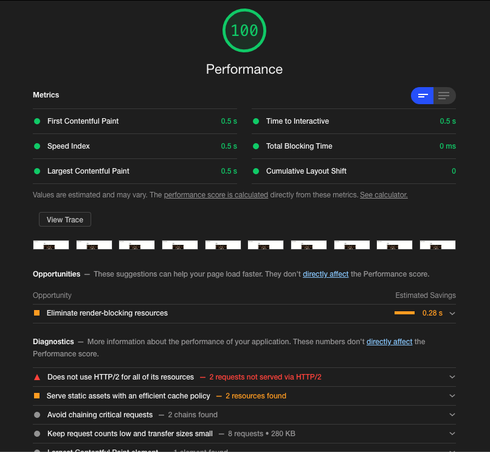

# Web Font Optimization Spike

**Resources:**

- [Avoid invisible text during font loading](https://web.dev/avoid-invisible-text/)
- [Optimize WebFont loading and rendering](https://web.dev/optimize-webfont-loading/)
- [Reduce WebFont Size](https://web.dev/reduce-webfont-size/)
- [Unicode Table](https://unicode-table.com/en/)
- [Unicode Range - CSS Tricks](https://css-tricks.com/almanac/properties/u/unicode-range/#:~:text=unicode%2Drange%20%7C%20CSS%2DTricks&text=The%20unicode%2Drange%20property%20in,supported%20by%20the%20font%20face.)

## Lighthouse reports

1. Without optimization



## Running application

1. Install dependencies

```
$ npm install
```

2. Start application

```
$ npm start
```
