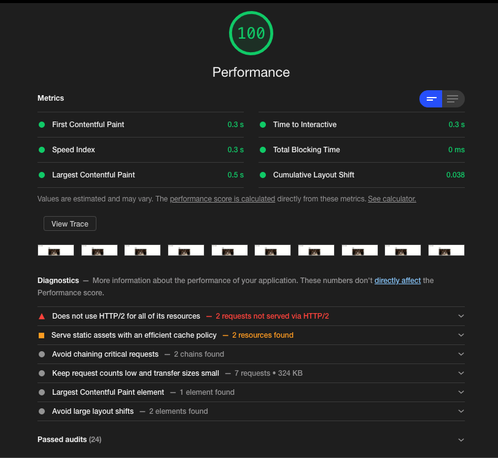
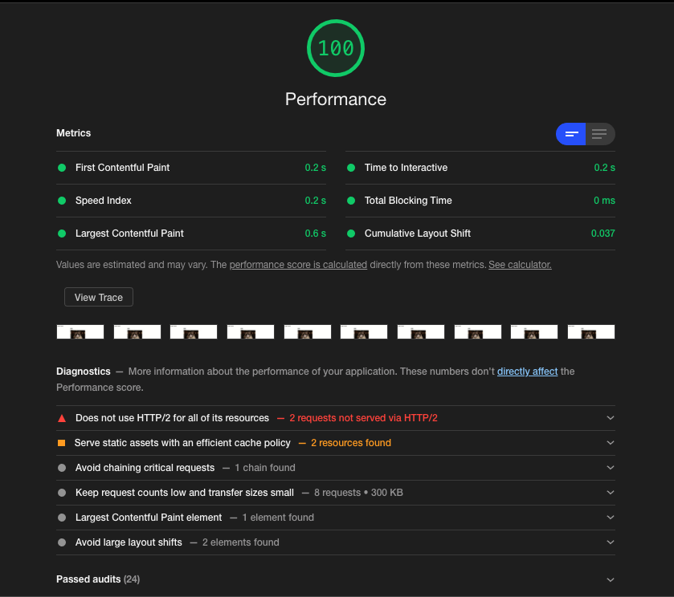

# Web Font Optimization Spike

**Resources:**

- [Avoid invisible text during font loading](https://web.dev/avoid-invisible-text/)
- [Optimize WebFont loading and rendering](https://web.dev/optimize-webfont-loading/)
- [Reduce WebFont Size](https://web.dev/reduce-webfont-size/)
- [Unicode Table](https://unicode-table.com/en/)
- [Unicode Range - CSS Tricks](https://css-tricks.com/almanac/properties/u/unicode-range/#:~:text=unicode%2Drange%20%7C%20CSS%2DTricks&text=The%20unicode%2Drange%20property%20in,supported%20by%20the%20font%20face.)

## Lighthouse reports

1. Without optimization


2. Using font-display swap

```
@font-face {
  font-family: "Barlow Condensed";
  font-style: normal;
  font-weight: 400;
  font-display: swap;
  src: local("Barlow Condensed Regular"), local("BarlowCondensed-Regular"),
    url(https://fonts.gstatic.com/s/barlowcondensed/v5/HTx3L3I-JCGChYJ8VI-L6OO_au7B6xHT2lv0tKk.woff2)
      format("woff2"),
    url(https://fonts.gstatic.com/s/archivonarrow/v12/tss0ApVBdCYD5Q7hcxTE1ArZ0Yb0.woff)
      format("woff");
}

@font-face {
  font-family: "Roboto Slab";
  font-style: normal;
  font-weight: 800;
  font-display: swap;
  src: url(https://fonts.gstatic.com/s/robotoslab/v12/BngbUXZYTXPIvIBgJJSb6s3BzlRRfKOFbvjoDIOmb2RlV9Su1cai.woff)
    format("woff");
}
```



3. Preload fonts

```
  <link rel="preload"
    href="https://fonts.gstatic.com/s/barlowcondensed/v5/HTx3L3I-JCGChYJ8VI-L6OO_au7B6xHT2lv0tKk.woff2" as="font"
    type="font/woff2" crossorigin>
  <link rel="preload" href="https://fonts.gstatic.com/s/archivonarrow/v12/tss0ApVBdCYD5Q7hcxTE1ArZ0Yb0.woff" as="font"
    type="font/woff" crossorigin>
  <link rel="preload"
    href="https://fonts.gstatic.com/s/robotoslab/v12/BngbUXZYTXPIvIBgJJSb6s3BzlRRfKOFbvjoDIOmb2RlV9Su1cai.woff"
    as="font" type="font/woff" crossorigin>
```



## Running application

1. Install dependencies

```
$ npm install
```

2. Start application

```
$ npm start
```
